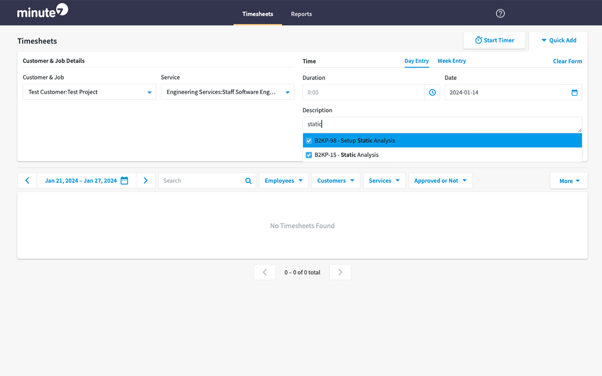

# Jira Minute7 Autocomplete Browser Extension

## Introduction

This extension provides Jira issue autocompletion to the Description text area in the Minute7 UI.

## Usage

- Install the Extension from your favorite browser extension store. Chrome, Firefox, & Safari are all intended to be supported.
- Click into the extension pane, fill in your Jira URL (e.g. `https://acme.atlassian.net`), your Jira username, and a Jira API token. Click _Save_
    - Jira API tokens can be created according to these instructions: <https://support.atlassian.com/atlassian-account/docs/manage-api-tokens-for-your-atlassian-account/>
- Navigate to <https://frontend.minute7.com> and sign in.
- Type into the description field and see Jira suggestions appear.